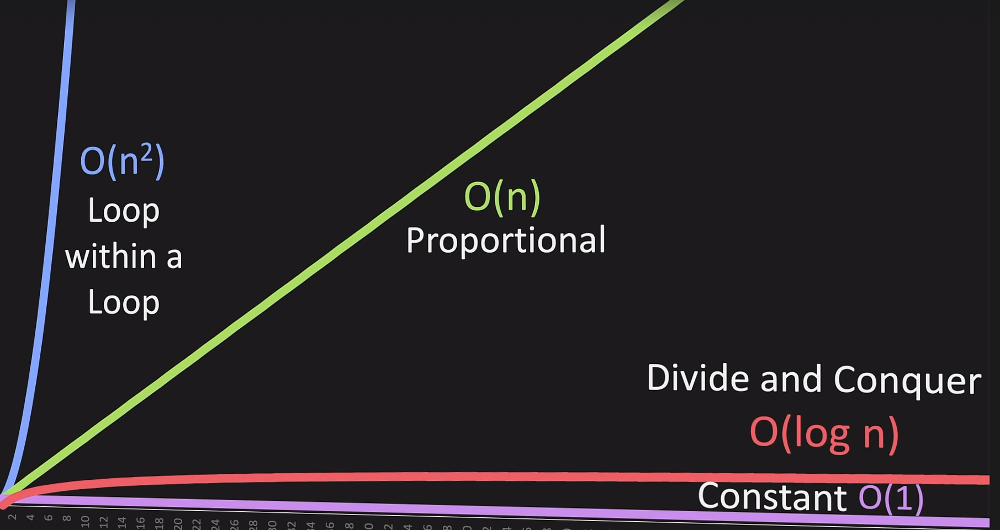

# Big O Basic Concepts

## O(1): Constant Time
- **Description**: The time complexity does not depend on the size of the data set.
- **Example**: Accessing an array element by its index.

## O(log n): Logarithmic Time
- **Description**: The algorithm splits the data in each step (divide and conquer).
- **Example**: Binary search.

## O(n): Linear Time
- **Description**: The time complexity is directly proportional to the size of the data set.
- **Example**: Looping through an array.

## O(n log n): Linearithmic Time
- **Description**: The algorithm splits and sorts or searches the data.
- **Example**: Merge sort, quick sort.

## O(n^2): Polynomial Time
- **Description**: The algorithm uses nested loops for each power of n.
- **Example**: Bubble sort (O(n^2)).

## Omega (Ω) – Best Case
- **Description**: Omega (Ω) describes the best-case scenario for an algorithm.
- **In simple terms**: It tells you the fastest an algorithm can run in the best circumstances.

## Theta (Θ) - Average Case
- **Description**: Theta (Θ) describes the average-case scenario for an algorithm.
- **In simple terms**: It tells you what to generally expect in terms of time complexity.

## Big O (O) - Worst Case
- **Description**: Big O (O) describes the worst-case scenario for an algorithm.
- **In simple terms**: It tells you the slowest an algorithm can run in the worst circumstances.

## Useful Tips

### Drop Non-Dominant Terms
- In \( O(n + n^2) \), focus on \( O(n^2) \) as it will dominate for large n.

### Drop Constants
- \( O(2n) \) simplifies to \( O(n) \).

https://www.bigocheatsheet.com/